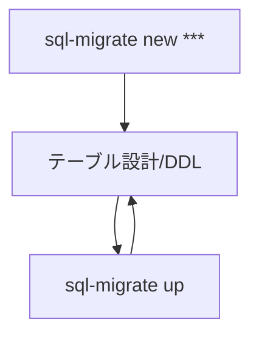
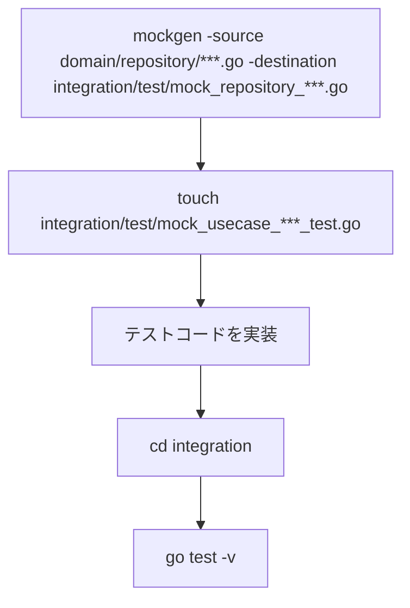
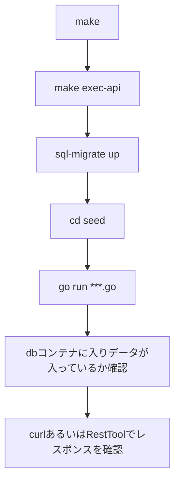

# 概要
ペットの健康管理アプリケーションを作成する

# Vueの立ち上げ
### コンテナ起動
```
$ make up-build
```

### コンテナに入る
```
$ make exec-vue
```

### vueフォルダに移動してvueを立ち上げる
```
$ cd vue
$ yarn run serve
```

### 起動確認
* [https://localhost:3000](https://localhost:3000) にアクセスすると画面が表示される

# ターミナルからのHTTPデータ送信

### TOP画面
```
$ curl 'http://127.0.0.1:4010/pet/info'
```
### 予定登録
```
$ curl -X POST 'http://127.0.0.1:4010/pet/schedule'
```

# sqlmigrate
コマンド集：　[Go製マイグレーションツールsql-migrate](https://qiita.com/k-kurikuri/items/946e2bf8c79176ef3ff0#%E3%82%B3%E3%83%9E%E3%83%B3%E3%83%89%E8%89%B2%E3%80%85)

作成したいテーブル、あるいは、ALTERしたいタスクが生じた場合、
"sql-migrate new ***"を行い、新しいmigrationファイルを作成、その中にDDLを記載する



# [go]mockを使用したテスト



`テストコードを実施`については以下参照  
https://qiita.com/ogady/items/34aae1b2af3080e0fec4#%E3%83%86%E3%82%B9%E3%83%88%E3%82%92%E6%9B%B8%E3%81%84%E3%81%A6%E3%81%BF%E3%82%8B

# 各種コマンド
Makefileを参照すること
必要に応じて記入お願いします

# Tips
### seedを投入して、POSTMANでAPIをリクエストするまで

go run ＊＊＊.goまで実行することで、テストデータが投入されます  
（＊＊＊.goは、実際にはファイル名を指定）

"dbコンテナに入りデータが入っているか確認"については、「mysqlでSQL実行」を確認


### mysqlでSQL実行

```sh
$ make exec-db
bash-4.2# mysql -uroot -p
{パスワードを入力}
mysql> use dev;
mysql> show tables;
mysql> describe pets;
mysql> select * from pets;
```
