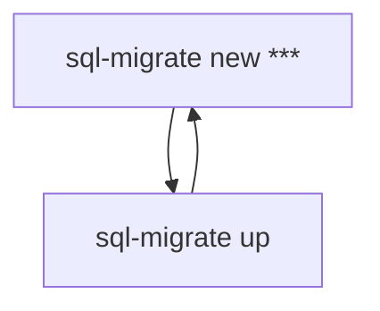

# 概要
DockerでVue3の環境を構築  
ペットの健康管理アプリケーションを作成する

# 立ち上げまでの流れ
## コンテナ起動
```
$ make up-build
```

## コンテナに入る
```
$ make exec-vue
```

## vueフォルダに移動してvueを立ち上げる
```
$ cd vue
$ yarn run serve
```

## 起動確認
* [https://localhost:3000](https://localhost:3000) にアクセスすると画面が表示される

## sqlmigrate
コマンド集：https://qiita.com/k-kurikuri/items/946e2bf8c79176ef3ff0#%E3%82%B3%E3%83%9E%E3%83%B3%E3%83%89%E8%89%B2%E3%80%85

作成したいテーブル、あるいは、ALTERしたいタスクが生じた場合、
"sql-migrate new ***"を行い、新しいmigrationファイルを作成、その中にDDLを記載する



## コマンドについて
Makefileを参照すること